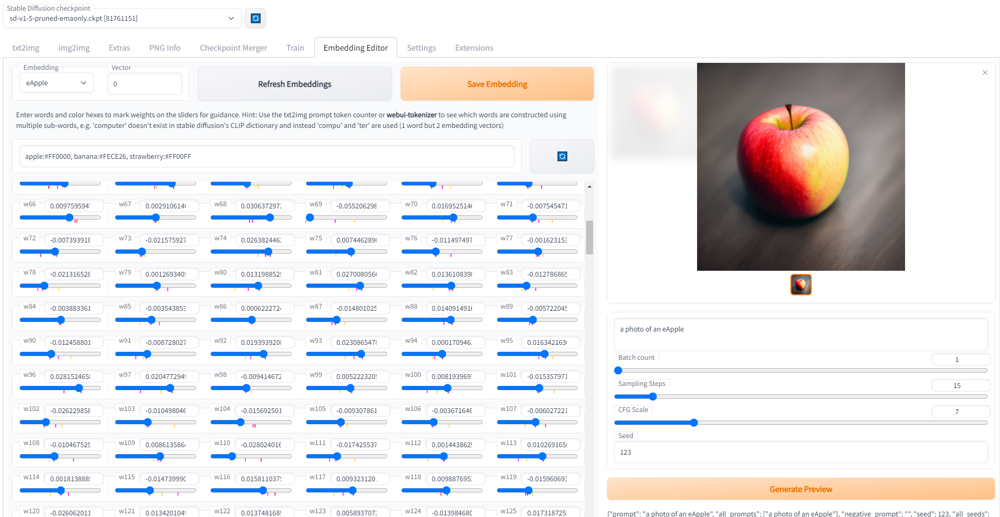

A very early WIP of an embeddings editor for AUTOMATIC1111's webui.

Should be placed in a sub-directory in extensions. e.g. \stable-diffusion-webui-master\extensions\embedding-editor\ You can now also install it automatically from the extensions tab in Automatic's UI.

It will likely add a small amount of startup time due to fetching all the original embeddings to calculate the ranges for the weight sliders, so it's probably better to only enable when you're using it for now.

My hope is that instead of say typing 'red shirt' and 'blue castle' and having those colours bleed into everything, you'd create a quick embedding RedShirt by starting with 'shirt' and shifting some weights to get an embedding for red shirts only, since a lot of embeddings have colour information which doesn't bleed into everything else in the image (e.g. apples, skin, trees, skies, water).

I'm not sure yet how possible that would be, but you can literally just blend the puppy and skunk embeddings (with 50% of each) to get a very functional SkunkPuppy embedding, like https://www.youtube.com/watch?v=0_BBRNYInx8&t=888s , which is much more useful than trying to use both skunk and puppy in a prompt. So I'm hoping that with the ability to tag the positions of other embeddings on the weight sliders, you can get an idea of what can and can't be shifted to stay within the bounds of difference concepts, and we might be able to figure out if each weight maps to particular features which can be labelled.

In my experience playing with it a bit so far, changing the vast majority of weights barely changes the output at all, which makes me hopeful that a lot of them are actually junk weights (or only apply for certain types of things which are unlocked by other weights), and just a few need to be paid attention to.

It currently doesn't check for invalid inputs and will likely error easily (e.g. you can enter invalid vector numbers, or click save embedding while no embedding is selected).

'Refresh Embeddings' will repopulate the embeddings list, though won't reset the weight sliders on the currently selected embedding. Select a different embedding or change the vector number to refresh the weight sliders.

Changing the vector number will lose any edited weights for the current vector. Saving the embedding first is required if you want to keep them.

It's not easy to get any useful results with this yet, though some features are planned which might help a lot.

These embeddings can be used as a starting point for textual inversion, or the results of textual inversion can be manually fine-tuned using these sliders. There are multiple valid embeddings for a given subject, so keeping certain weights in a range which causes the embedding to behave as the type of object which you want (e.g. a shirt, a person, a pose) may be useful, though would be better worked into the textual inversion process as a regulation method.

---

I'd also recommend checking out Embedding Inspector, which looks like it does a lot of what I was intending to do: https://github.com/tkalayci71/embedding-inspector
